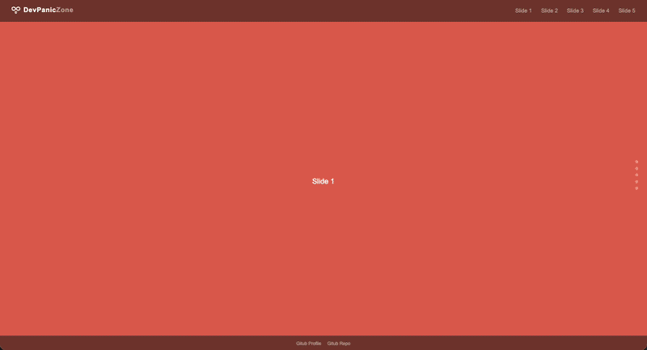

# CSS Animation Showcase Loop (EN)

**EN** | [DE](#css-animation-showcase-loop-de)

A vertical fullscreen loop scroller built as a demo implementation of various CSS animation techniques — built with vanilla HTML, CSS, and JavaScript. No framework, no CDN dependencies, no tracking.

[](https://dontdevpanic.github.io/css-animations-showcase/)

[](https://dontdevpanic.github.io/css-animations-showcase/)

---

## What is this?

This project is a showcase demo built on top of the [vertical-fullscreen-loop-scroll](https://github.com/dontdevpanic/vertical-fullscreen-loop-scroll) mechanism. Five slides, five different CSS animation techniques — as an endless, color-cycling loop.

## Animation Techniques

| Slide | Technique |
|-------|-----------|
| Slide 1 | **Word Flash Sequence** — words fade in and out one by one, the last one stays |
| Slide 2 | **CSS Ticker** — continuously scrolling text banner via `animation: translateX` |
| Slide 3 | **Stagger Reveal** — words appear from below with staggered delays |
| Slide 4 | **Slide In Left / Right** — lines fly in alternately from left and right |
| Slide 5 | **Typewriter Effect** — text is built character by character via `width: 0 → 100%` |

## Features

- Endless vertical loop with color palette cycling each round
- CSS animations restart on every slide visit (via `is-visible` class + reflow trick)
- ScrollSpy: navbar links and dot navigation synced with active slide
- Hamburger menu with overlay navigation for mobile breakpoints
- Scroll via mouse wheel, keyboard navigation, and direct link jumps
- Respects `prefers-reduced-motion`
- Semantic HTML, WCAG AA targeted

## Stack

```
HTML · CSS · Vanilla JS
```

No frameworks. No build tools. No external dependencies.  
Font: [Bebas Neue](https://fonts.google.com/specimen/Bebas+Neue) (self-hosted via `@font-face`)

## Local Usage

Clone the repository and open `index.html` directly in your browser — done.

```bash
git clone https://github.com/dontdevpanic/css-animations-showcase.git
```

## Project Context

This repo is part of a three-part series:

- [vertical-fullscreen-loop-scroll](https://github.com/dontdevpanic/vertical-fullscreen-loop-scroll) — the pure loop mechanism
- **css-animations-showcase** ← you are here — CSS animation techniques demonstrated on top of that mechanism
- [darkground-coffee](https://github.com/dontdevpanic/darkground-coffee) — a real demo website applying both in an actual page structure

---

## License

MIT — do whatever you want with it.

---
---

# CSS Animation Showcase Loop (DE)

[EN](#css-animation-showcase-loop-en) | **DE**

Ein vertikaler Fullscreen-Loop-Scroller als Demo-Implementierung verschiedener CSS-Animationstechniken — gebaut mit Vanilla HTML, CSS und JavaScript. Kein Framework, keine CDN-Abhängigkeiten, kein Tracking.

[](https://dontdevpanic.github.io/css-animations-showcase/)

[](https://dontdevpanic.github.io/css-animations-showcase/)

---

## Was ist das?

Dieses Projekt ist eine Showcase-Demo, die auf dem [vertical-fullscreen-loop-scroll](https://github.com/dontdevpanic/vertical-fullscreen-loop-scroll) Mechanismus aufbaut. Fünf Slides, fünf verschiedene CSS-Animationstechniken — als endloser, farbwechselnder Loop.

## Animationstechniken

| Slide | Technik |
|-------|---------|
| Slide 1 | **Word Flash Sequence** — Wörter blenden nacheinander ein und aus, das letzte bleibt stehen |
| Slide 2 | **CSS Ticker** — Endlos laufendes Textband via `animation: translateX` |
| Slide 3 | **Stagger Reveal** — Wörter tauchen mit versetztem Delay von unten auf |
| Slide 4 | **Slide In Left / Right** — Zeilen fliegen abwechselnd von links und rechts herein |
| Slide 5 | **Typewriter Effect** — Text wird Zeichen für Zeichen mit `width: 0 → 100%` aufgebaut |

## Features

- Endloser vertikaler Loop mit Farbpalettenwechsel pro Runde
- CSS-Animationen starten neu bei jedem Slide-Besuch (via `is-visible` Klasse + Reflow-Trick)
- ScrollSpy: Navbar-Links und Dot-Navigation synchronisiert mit aktivem Slide
- Hamburger-Menü mit Overlay-Navigation für mobile Breakpoints
- Scroll per Mausrad, Tastatur-Navigation und direkte Link-Sprünge
- `prefers-reduced-motion` berücksichtigt
- Semantisches HTML, WCAG AA angestrebt

## Stack

```
HTML · CSS · Vanilla JS
```

Keine Frameworks. Keine Build-Tools. Keine externen Abhängigkeiten.  
Font: [Bebas Neue](https://fonts.google.com/specimen/Bebas+Neue) (lokal eingebunden via `@font-face`)

## Lokale Nutzung

Repository klonen und `index.html` direkt im Browser öffnen — fertig.

```bash
git clone https://github.com/dontdevpanic/css-animations-showcase.git
```

## Projektkontext

Dieses Repo ist Teil einer dreiteiligen Reihe:

- [vertical-fullscreen-loop-scroll](https://github.com/dontdevpanic/vertical-fullscreen-loop-scroll) — der pure Loop-Mechanismus
- **css-animations-showcase** ← du bist hier — CSS Animationstechniken auf diesem Mechanismus
- [darkground-coffee](https://github.com/dontdevpanic/darkground-coffee) — eine echte Demo-Website, die beides in einer realen Seitenstruktur anwendet

---

## Lizenz

MIT — mach damit, was du willst.

---

*Built by [Bianca | DevPanicZone](https://github.com/dontdevpanic)*